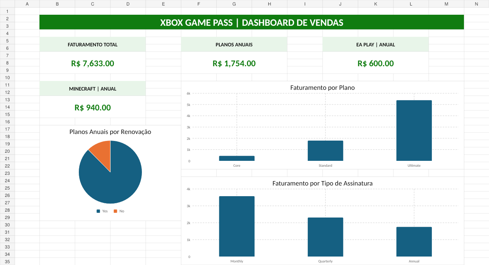

# 📊 Dashboard de Vendas Xbox

## 📌 Sobre o projeto

Este projeto foi desenvolvido com o objetivo de criar um **dashboard de vendas no Excel**, transformando dados brutos em informações visuais claras e úteis para apoiar a análise de desempenho e a tomada de decisões.

O projeto faz parte de um desafio prático de análise e visualização de dados.

## 🎯 Objetivo

Organizar e analisar os dados de vendas, apresentando os principais indicadores de forma simples e visual por meio de um dashboard desenvolvido no Excel.

## 📈 Indicadores analisados

O dashboard permite acompanhar informações como:

- Faturamento total;
- Faturamento por tipo de plano;
- Análise das assinaturas com renovação automática;
- Faturamento relacionado ao EA Play;
- Faturamento relacionado ao Minecraft;
- Distribuição das vendas por tipo de assinatura.

## 🗂️ Estrutura da planilha

O arquivo Excel está organizado nas seguintes abas:

- **Bases:** contém os dados utilizados na análise;
- **Calculos:** reúne os cálculos e indicadores utilizados no dashboard;
- **Dashboard:** apresenta os indicadores e gráficos de forma visual.

## 🛠️ Ferramentas utilizadas

- Microsoft Excel
- Fórmulas e funções do Excel
- Gráficos e visualização de dados
- Organização e tratamento de dados
- GitHub para documentação e entrega do projeto

## 🖼️ Preview do Dashboard

## ▶️ Como reproduzir

1. Faça o download ou clone este repositório.
2. Abra o arquivo `desafio_dashboard_vendas_xbox.xlsx` no Microsoft Excel.
3. Consulte a aba **Bases** para visualizar os dados utilizados.
4. Acesse a aba **Calculos** para conferir os indicadores.
5. Abra a aba **Dashboard** para visualizar os resultados e gráficos.

## ✅ Conclusão

Este projeto demonstra a utilização do Excel para transformar dados brutos em informações relevantes, utilizando cálculos, indicadores e visualizações para facilitar a análise do desempenho das vendas.
